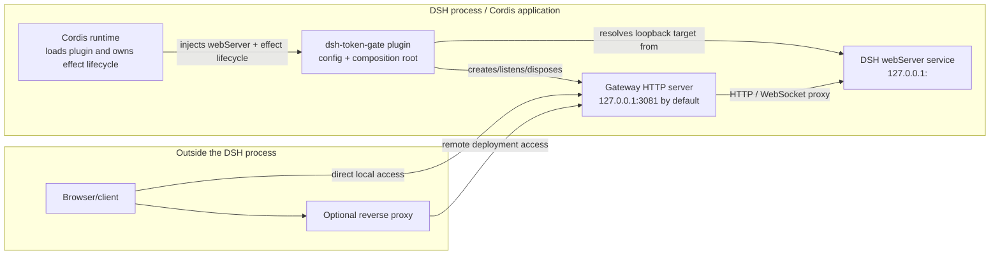
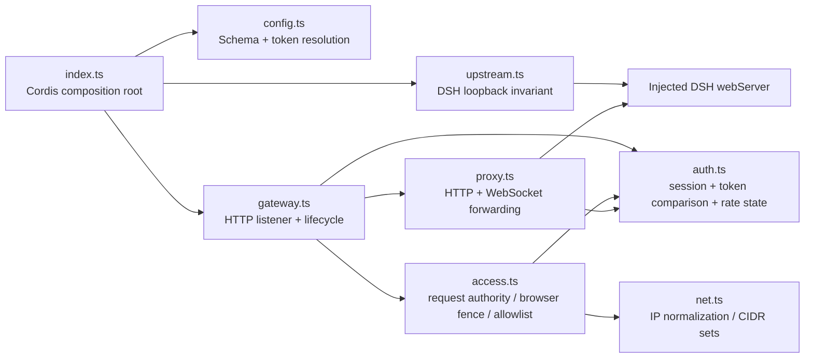
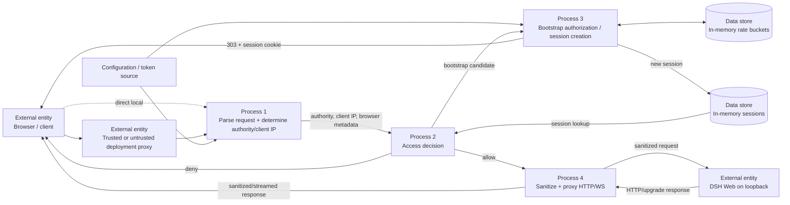
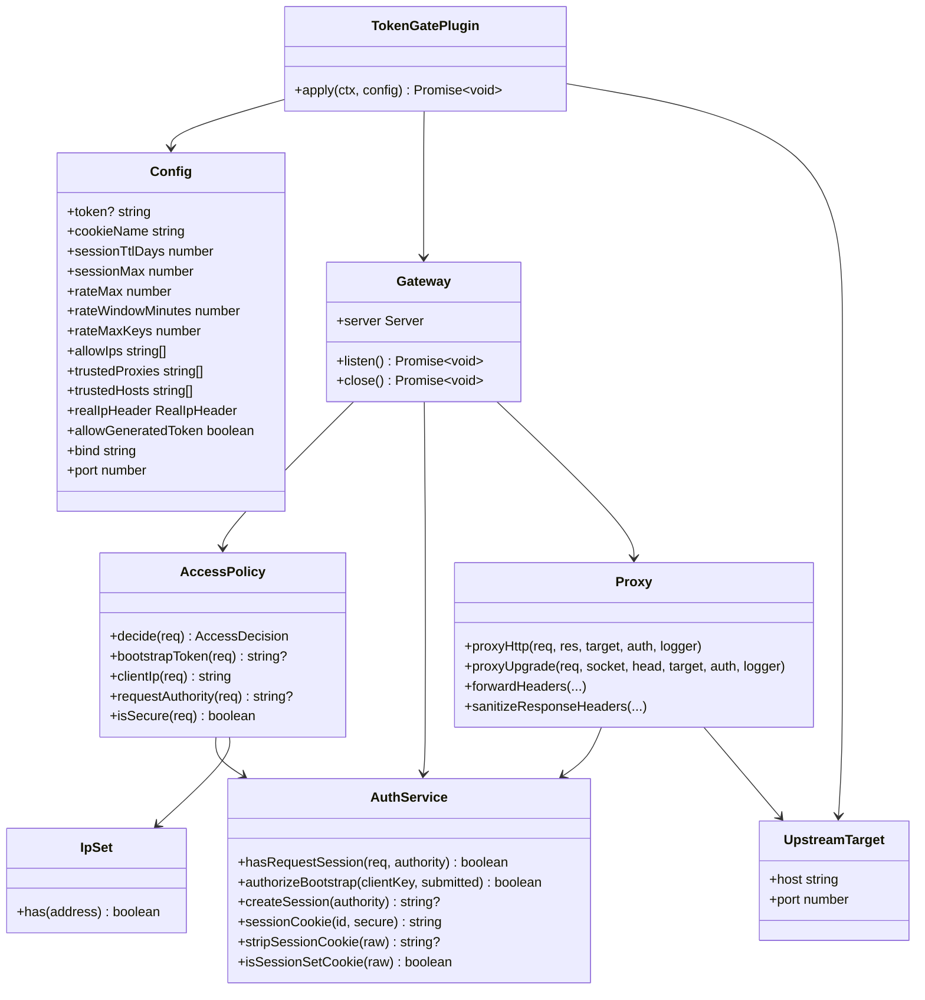
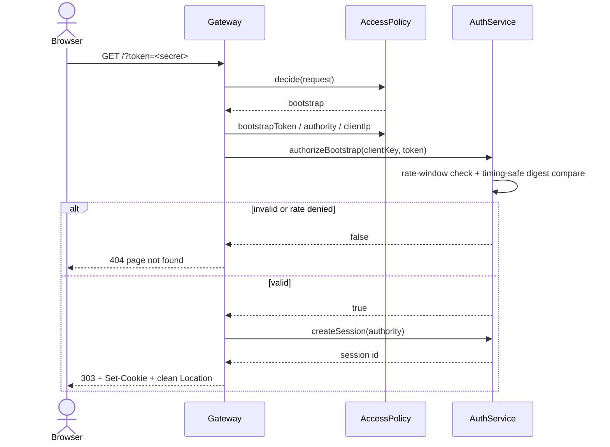
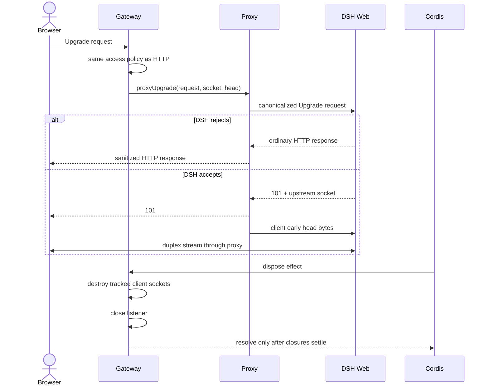
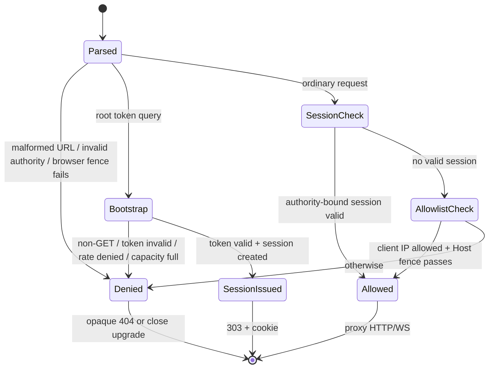

# Architecture

This document visualizes the implemented architecture described by [`system.md`](./system.md). Diagrams intentionally model the current small plugin rather than a future identity platform.

## C4 Level 1 — System context

```mermaid
flowchart LR
    U["Person: DSH user\nUses a browser to access DSH"]
    OP["External system: deployment proxy\nOptional Caddy / cloudflared\nTLS termination and normalized forwarded headers"]
    TG["Software system: dsh-token-gate\nBootstrap token, session boundary, IP allowlist, HTTP/WS proxy"]
    DSH["External software system: DeepSeek Harness Web\nLoopback-only application server"]
    ENV["External configuration\nCordis config + DSH_AUTH_TOKEN"]

    U -->|HTTPS/HTTP + WebSocket| OP
    U -. local development .->|HTTP + WebSocket| TG
    OP -->|HTTP/WS to configured gateway port| TG
    ENV -->|startup configuration / secret| TG
    TG -->|sanitized HTTP/WS| DSH
```

The trust boundary is the gateway listener. The deployment proxy is optional and is not automatically trusted: its address must be present in `trustedProxies` before forwarded identity/protocol headers affect decisions.

## C4 Level 2 — Containers / runtime boundary



`dsh-token-gate` and DSH run in the same Node/Cordis process, but the gateway uses a separate Node HTTP listener and proxies over loopback to the DSH Web listener. No external session store exists.

## Component view



The dependency direction keeps policy/state separate from transport forwarding. `gateway.ts` composes decisions but does not own IP parsing or token/session internals.

## Data-flow diagram



### Sensitive-data flow

The bootstrap token is accepted only on the root bootstrap request and is used only for comparison. It is never forwarded to DSH as gateway authentication data. The gateway session cookie is consumed at the access boundary and stripped before upstream forwarding. Session IDs and rate buckets exist only in process memory.

## UML class/dependency view



## UML sequence — first bootstrap



## UML sequence — authorized HTTP request

```mermaid
sequenceDiagram
    actor B as Browser
    participant G as Gateway
    participant A as AccessPolicy
    participant S as AuthService
    participant P as Proxy
    participant D as DSH Web

    B->>G: HTTP request + session cookie
    G->>A: decide(request)
    A->>S: hasRequestSession(request, authority)
    S-->>A: valid / invalid
    alt denied
        A-->>G: deny
        G-->>B: opaque 404
    else allowed
        A-->>G: allow
        G->>P: proxyHttp(...)
        P->>P: strip gateway/proxy/hop headers; rewrite Host/Origin
        P->>D: sanitized streaming request
        D-->>P: response stream
        P->>P: sanitize headers / protect gateway cookie namespace
        P-->>B: response stream
    end
```

## UML sequence — WebSocket upgrade and disposal



## UML state view — request authorization



## Lifecycle notes

The only persistent configuration is external Cordis/process configuration. Sessions and rate-limit records are not durable. This is a current behavior, not an omitted storage component in the diagrams. Adding durable device/session trust would change both the C4/data-flow views and `TG-SESS-004`, so it requires a separate spec change.