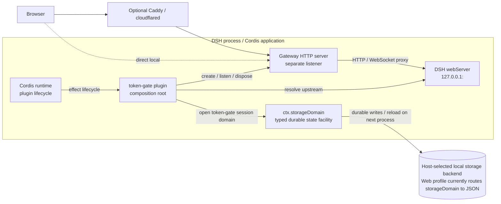
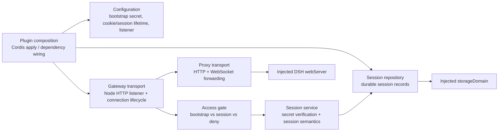
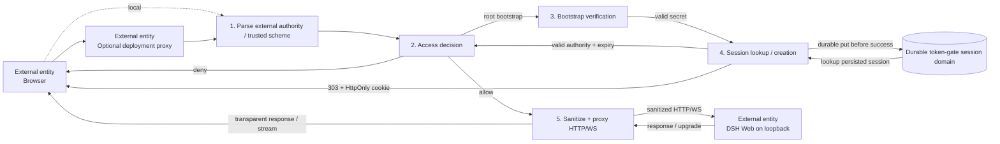
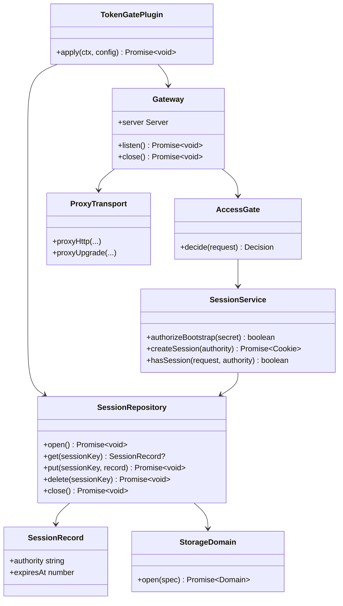
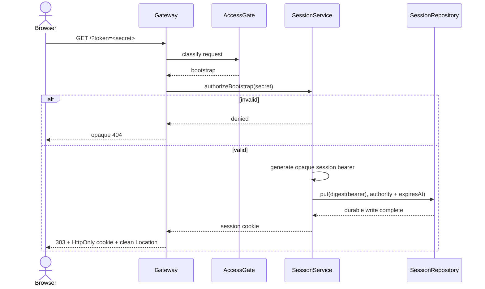
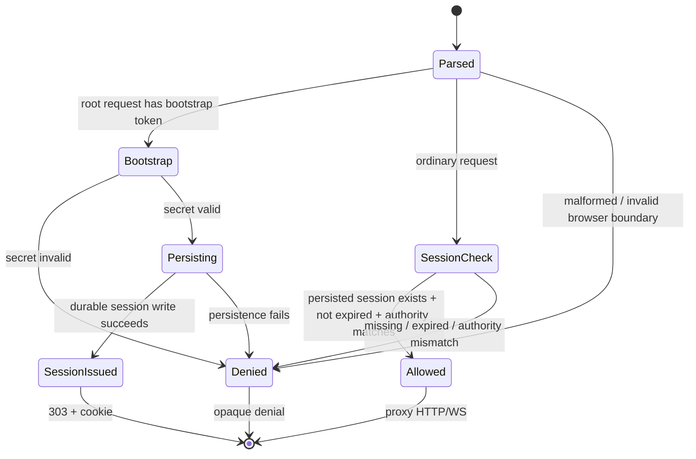

# Architecture

Status: **structural authority derived from `requirement.md`**

This document defines the intended structure used to satisfy the product Requirement. It is not a diagram of every detail currently present in `src/`.

## Design principles

1. **DSH stays private.** DSH Web remains on loopback; token-gate is the browser-facing boundary.
2. **Proxy, do not invade DSH internals.** Authorized traffic uses DSH's existing HTTP/WebSocket surface instead of modifying agent/session/UI internals.
3. **Persist authorization through the host storage seam.** Browser sessions must survive token-gate/DSH process recreation until expiry.
4. **Use DSH/Cordis services before inventing parallel infrastructure.** Lifecycle comes from Cordis, upstream discovery from `webServer`, and durable state from DSH `storageDomain`.
5. **Keep the product smaller than a general auth platform.** Network allowlists, user accounts, and provider-specific proxy logic are outside the current architecture.

## C4 Level 1 — System context

```mermaid
flowchart LR
    U["Person: DSH user\nUses DSH through a browser"]
    RP["Optional deployment proxy\nTLS termination / local forwarding"]
    TG["Software system: dsh-token-gate\nBootstrap secret -> durable browser session\nHTTP/WebSocket access gate"]
    DSH["External software system: DSH Web\nLoopback-only application server"]
    STORE["DSH durable storage capability\nHost-managed local persistence"]

    U -->|HTTPS/HTTP + WebSocket| RP
    U -. local development .->|HTTP + WebSocket| TG
    RP -->|HTTP/WS| TG
    TG -->|authorized, sanitized HTTP/WS| DSH
    TG -->|session records| STORE
```

The optional deployment proxy is infrastructure, not part of the authentication model. Token-gate owns the authorization decision regardless of whether the browser reaches it directly or through a local reverse proxy.

## C4 Level 2 — Runtime containers



Token-gate does **not** own a standalone database process. It consumes the DSH storage-domain capability and therefore follows the storage backend selected by the host profile. The Web profile already provides storage and a local backend; another profile may route the same domain differently.

## Main component boundaries



### Ownership

- **Composition** owns Cordis integration and service acquisition.
- **Gateway transport** owns the public listener and accepted client sockets.
- **Access gate** decides only `bootstrap`, `allow`, or `deny` from request metadata and session state.
- **Session service** owns bootstrap verification, cookie/session semantics, expiry, and authority binding.
- **Session repository** owns durable storage of session records through `ctx.storageDomain`.
- **Proxy transport** owns protocol forwarding and HTTP/WebSocket sanitization; it does not decide authentication.

No IP allowlist component belongs to the current core design.

## Persistent session design

### Storage seam

Token-gate opens one dedicated DSH storage domain through `ctx.storageDomain` during plugin activation.

The domain contains a `sessions` table. Conceptually:

```text
SessionRecord {
  authority: string
  expiresAt: number
}
```

The session cookie carries an opaque random bearer value. The durable table key should be a stable one-way digest derived from that bearer value so the raw cookie credential does not need to be stored as durable data.

### Durability rule

A successful bootstrap must persist the new session record **before** returning the `303` response and cookie. Once the browser receives a successful bootstrap response, immediate process restart must not invalidate that newly issued session.

### Read path

The storage-domain facility loads durable records when the domain opens and serves reads from its authoritative in-memory view. Normal request authorization therefore does not require opening a database/file per HTTP request.

For each request:

1. read the cookie bearer value;
2. derive the repository key;
3. resolve the persisted session record;
4. reject absent or expired records;
5. require the recorded external authority to match the current request authority.

Expired-record cleanup may be lazy. Expiry enforcement is part of the authorization contract; the exact cleanup schedule is not.

### Lifecycle

The token-gate consumer owns its opened domain handle and closes it during Cordis disposal. Closing the domain releases runtime resources but **does not delete persisted session records**. On the next plugin/process instance, reopening the same domain restores still-valid sessions.

The persistence backend and its physical location remain host concerns rather than token-gate configuration.

## Data-flow diagram



### Sensitive-data flow

The bootstrap secret is used only to authorize bootstrap and must not be proxied to DSH. The session cookie is consumed by token-gate and removed before forwarding. Persisted session state contains the authorization metadata required to validate a cookie across restarts; the raw session bearer need not be persisted.

## UML class/dependency view



## UML sequence — first bootstrap



## UML sequence — authorized request after restart

```mermaid
sequenceDiagram
    actor B as Browser
    participant G as New Gateway Process
    participant S as SessionService
    participant R as Reopened SessionRepository
    participant P as ProxyTransport
    participant D as DSH Web

    Note over G,R: plugin/process was restarted; persistent domain has been reopened
    B->>G: request + existing cookie
    G->>S: validate session(cookie, authority)
    S->>R: get(digest(cookie))
    R-->>S: authority + expiresAt
    S-->>G: valid
    G->>P: proxy authorized request
    P->>D: sanitized request
    D-->>P: HTTP/WS response
    P-->>B: transparent response
```

## UML sequence — WebSocket and disposal

```mermaid
sequenceDiagram
    actor B as Browser
    participant G as Gateway
    participant P as ProxyTransport
    participant D as DSH Web
    participant R as SessionRepository
    participant C as Cordis

    B->>G: authorized Upgrade request
    G->>P: proxyUpgrade(...)
    P->>D: sanitized Upgrade request
    D-->>P: 101 or ordinary HTTP rejection
    P-->>B: relay accepted/rejected result

    C->>G: dispose plugin
    G->>G: close listener + tracked client sockets
    C->>R: close opened token-gate domain
    R-->>C: runtime handle closed; durable records retained
```

## UML authorization state



## Current implementation delta

The code merged through PR #3 predates this Requirement/Architecture correction. Two known mismatches are intentionally visible rather than normalized into the design:

- session records are currently process-local instead of using `ctx.storageDomain`, so restart persistence required by R-003 is not yet implemented;
- the current code still contains IP allowlist/client-IP machinery, but IP allowlist authentication is not part of the current Requirement and should not shape core Spec or verification.

These are implementation gaps to be corrected downstream. They are not reasons to weaken Requirement or Architecture to match existing code.