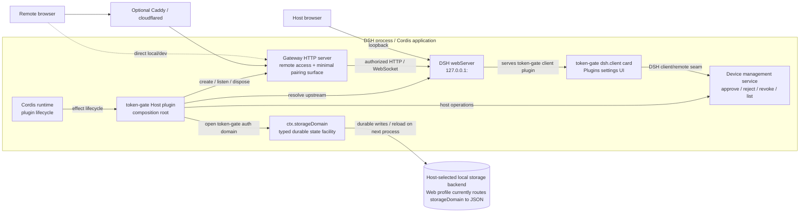
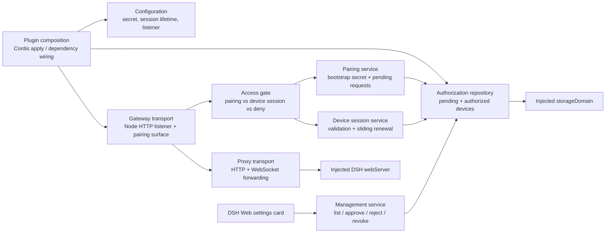
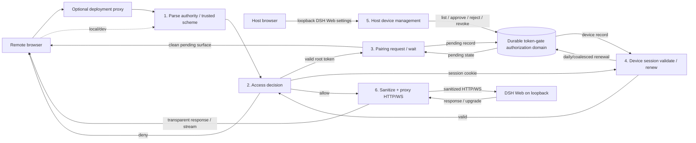
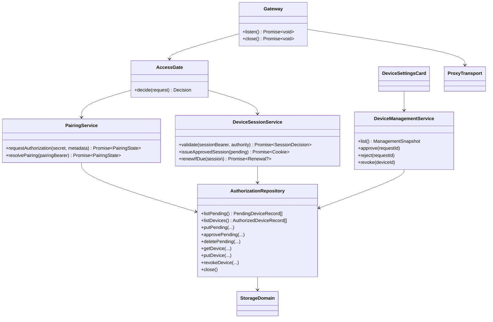
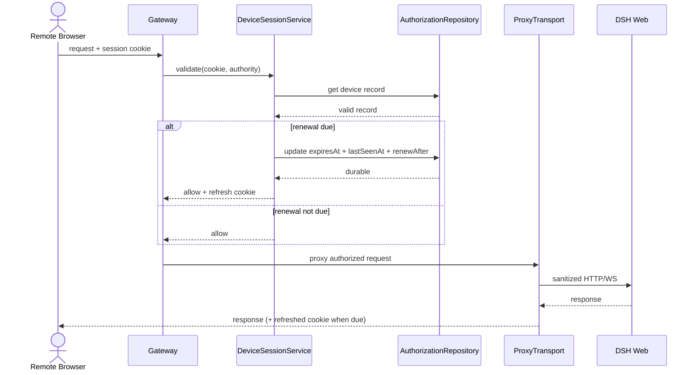
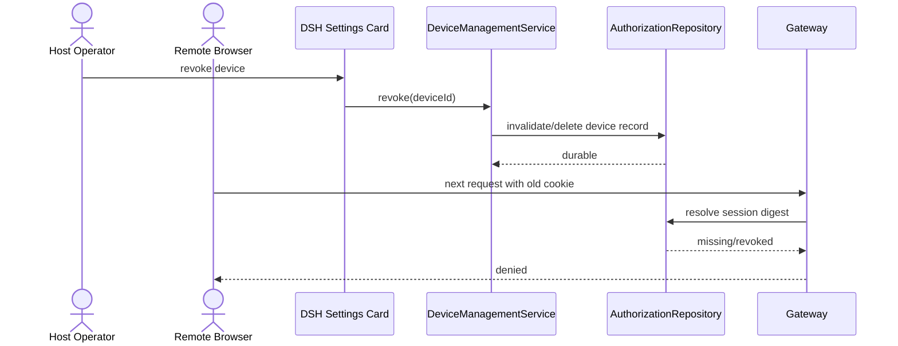
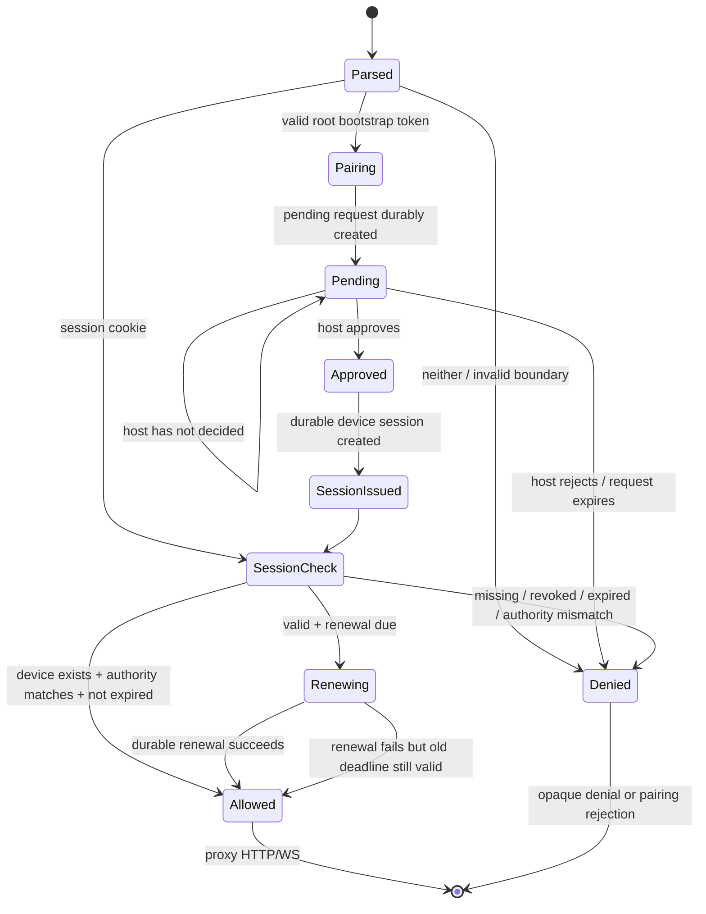

# Architecture

Status: **structural authority derived from `requirement.md`**

This document defines the intended structure used to satisfy the product Requirement. It is not a diagram of every detail currently present in `src/`.

## Design principles

1. **DSH stays private.** DSH Web remains on loopback; token-gate is the remote browser-facing boundary.
2. **Host controls trust.** Possessing the bootstrap secret may request access, but an unapproved remote device cannot reach DSH.
3. **Proxy, do not invade DSH internals.** Authorized traffic uses DSH's existing HTTP/WebSocket surface.
4. **Persist authorization through the host storage seam.** Device authorization and sessions survive process recreation.
5. **Use sliding inactivity expiry without hot writes.** Active sessions renew, but durable refreshes are coalesced to roughly once per day.
6. **Use DSH/Cordis services before inventing parallel infrastructure.** Lifecycle comes from Cordis, upstream discovery from `webServer`, durable state from `storageDomain`, and the host UI uses DSH's client/settings extension surface.
7. **Keep the product smaller than a general auth platform.** Network allowlists, user accounts, and provider-specific proxy logic are outside the current architecture.

## C4 Level 1 — System context

```mermaid
flowchart LR
    RU["Person: remote DSH user\nRequests device authorization"]
    HO["Person: host operator\nApproves/revokes devices locally"]
    RP["Optional deployment proxy\nTLS termination / local forwarding"]
    TG["Software system: dsh-token-gate\nPairing + durable device sessions\nHTTP/WebSocket access gate"]
    DSH["External software system: DSH Web\nLoopback-only application + host admin UI"]
    STORE["DSH durable storage capability\nHost-managed local persistence"]

    RU -->|HTTPS/HTTP + WebSocket| RP
    RU -. direct local/dev .->|HTTP + WebSocket| TG
    RP -->|HTTP/WS| TG
    TG -->|authorized, sanitized HTTP/WS| DSH
    TG -->|pending requests + device sessions| STORE
    HO -->|loopback DSH Web| DSH
    DSH -->|token-gate management card/actions| TG
```

The optional deployment proxy is infrastructure, not part of the authorization model. The host administration path remains local through loopback DSH Web; the device list and approval controls are not exposed as a public remote management application.

## C4 Level 2 — Runtime containers



The token-gate package therefore has two faces:

- a **Host face** that owns the gateway, authorization state, storage, and management operations;
- a **Web client face** that renders a small device-management card inside DSH Web settings.

This follows DSH's existing plugin-client/settings model instead of creating another standalone administration site.

## Main component boundaries



### Ownership

- **Gateway transport** owns the remote listener, minimal pending-approval surface, and accepted client sockets.
- **Pairing service** owns bootstrap-secret verification and creation/resolution of pending device requests.
- **Device session service** owns session bearers, authority binding, expiry, sliding renewal, and cookie semantics.
- **Authorization repository** owns durable pending requests and authorized-device records through `ctx.storageDomain`.
- **Management service** owns host actions over authorization state.
- **DSH Web settings card** is only a presentation surface for the host; it does not own authorization state.
- **Proxy transport** forwards already-authorized HTTP/WebSocket traffic and does not decide authorization.

No IP allowlist component belongs to the current core design.

## Durable authorization model

Token-gate opens one dedicated storage domain through `ctx.storageDomain`.

The domain has two conceptual tables.

```text
PendingDeviceRecord {
  authority: string
  label?: string
  browser?: string
  requestedAt: number
  expiresAt: number
  state: "pending" | "approved"
}

AuthorizedDeviceRecord {
  authority: string
  label?: string
  browser?: string
  createdAt: number
  lastSeenAt: number
  expiresAt: number
  renewAfter: number
}
```

Keys are stable one-way digests of opaque browser bearers. Raw pairing/session bearer values do not need to be persisted.

### Pairing flow

1. The browser requests `/?token=<secret>`.
2. The gateway validates the secret and browser boundary.
3. A short-lived opaque pairing bearer is generated and its pending record is durably written.
4. The bootstrap secret is removed from the visible URL immediately; the browser receives only the temporary pairing state required to wait for approval.
5. The host settings card lists the pending request.
6. The host approves or rejects it.
7. After approval, the browser's next pairing poll/request exchanges the approved pending state for a durable authorized-device session, deletes/consumes the pending request, sets the long-lived HttpOnly session cookie, and redirects to the clean DSH route.

A rejected, expired, or missing pending request cannot become a session.

The public pairing surface should remain minimal: it needs only enough UI/protocol to indicate that host approval is pending and to detect approval/rejection. It is not a general login/status application.

### Sliding session renewal

An authorized device record uses inactivity expiry.

For every authorized request:

1. resolve the persisted device record from the session bearer digest;
2. deny if absent, expired, revoked/deleted, or bound to a different authority;
3. allow the request when valid;
4. if `now >= renewAfter`, durably update `expiresAt`, `lastSeenAt`, and `renewAfter`, then refresh the browser cookie lifetime.

The intended default refresh interval is roughly 24 hours. Therefore ordinary traffic performs reads from the storage-domain in-memory view, while an active device normally causes at most one durable renewal write per day.

A renewal write failure does not create a longer session than durable state proves. The current request may continue under the still-valid existing deadline, but no refreshed cookie/deadline is issued until the durable update succeeds.

### Revocation

Host revocation removes or marks the authorized-device record invalid. The next request using that session bearer is denied.

Revocation is not a permanent ban. A revoked device can present the bootstrap secret again, create a new pending request, and become authorized again only after host approval.

### Lifecycle

Closing the token-gate storage-domain handle releases runtime resources but does not delete valid authorization records. Reopening the same domain after process restart restores pending/authorized state subject to expiry.

The persistence backend and physical location remain host concerns.

## Data-flow diagram



## UML class/dependency view



## UML sequence — token to host-approved device

```mermaid
sequenceDiagram
    actor R as Remote Browser
    actor H as Host Operator
    participant G as Gateway
    participant P as PairingService
    participant Repo as AuthorizationRepository
    participant UI as DSH Settings Card
    participant S as DeviceSessionService

    R->>G: GET /?token=<secret>
    G->>P: requestAuthorization(secret, metadata)
    P->>Repo: persist pending request
    Repo-->>P: durable
    G-->>R: clean URL + temporary pairing state

    H->>UI: open device management
    UI->>Repo: list pending via host management service
    Repo-->>UI: pending device
    H->>UI: approve
    UI->>Repo: mark approved

    R->>G: pairing poll/request
    G->>P: resolve approved pairing
    P->>S: issueApprovedSession(...)
    S->>Repo: persist authorized device; consume pending
    Repo-->>S: durable
    G-->>R: session cookie + 303 to DSH
```

## UML sequence — authorized request with coalesced renewal



## UML sequence — host revocation



## UML authorization state



## Current implementation delta

The code merged through PR #3 predates this Requirement/Architecture correction. Known mismatches are intentionally visible rather than normalized into the design:

- session records are process-local instead of using `ctx.storageDomain`;
- bootstrap currently issues a session immediately instead of creating a host-approved pending device request;
- there is no DSH Web device-management client surface yet;
- session expiry is fixed rather than sliding/coalesced by activity;
- current code still contains IP allowlist/client-IP machinery that is outside the current Requirement.

These are downstream implementation gaps, not reasons to weaken Requirement or Architecture.